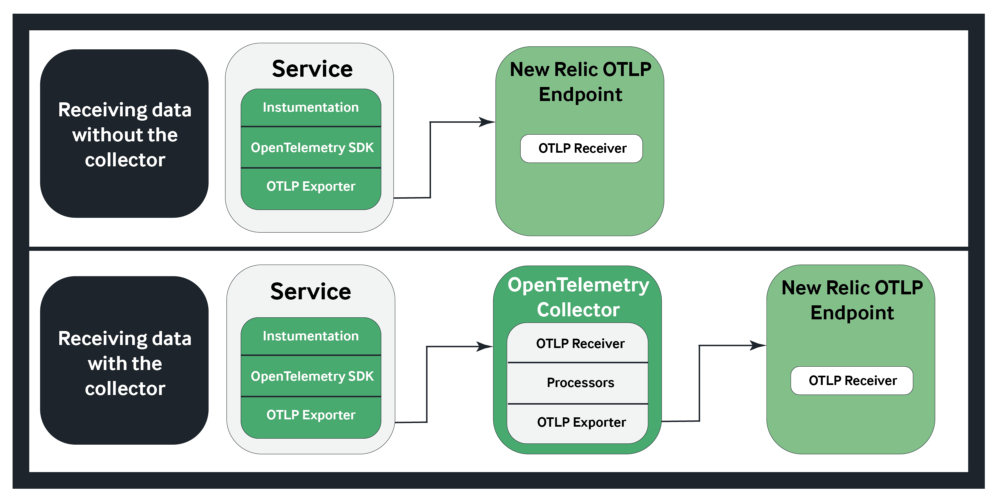

# Additional Challenges
This portion of the workshop is intended for someone who has completed labs 1-4 with time to spare before moving onto the final portion of this workshop, lab 5, which is a group activity that will be completed in small groups.

##Challenge 1 - APM vs OTel
Each of the 11 microservices in this application are listed below. One of these microservices has not been instrumented with OpenTelemetry, it has been instrumented with the New Relic APM agent. Use the New Relic Platform to identify which microservice is instrumented with APM. Once you have done that, compare this service with at least one other service in the app to compare and contrast differences in the way charts/dashboards appear by default, how custom queries must differ in order to receive simlar data across different agents, etc.    

| Service                                              | Language      | Description                                                                                                                       |
| ---------------------------------------------------- | ------------- | --------------------------------------------------------------------------------------------------------------------------------- |
| [frontend](./src/frontend)                           | Go            | Exposes an HTTP server to serve the website. Does not require signup/login and generates session IDs for all users automatically. |
| [cartservice](./src/cartservice)                     | C#            | Stores the items in the user's shopping cart in Redis and retrieves it.                                                           |
| [productcatalogservice](./src/productcatalogservice) | Go            | Provides the list of products from a JSON file and ability to search products and get individual products.                        |
| [currencyservice](./src/currencyservice)             | Node.js       | Converts one money amount to another currency. Uses real values fetched from European Central Bank. It's the highest QPS service. |
| [paymentservice](./src/paymentservice)               | Node.js       | Charges the given credit card info (mock) with the given amount and returns a transaction ID.                                     |
| [shippingservice](./src/shippingservice)             | Go            | Gives shipping cost estimates based on the shopping cart. Ships items to the given address (mock)                                 |
| [emailservice](./src/emailservice)                   | Python        | Sends users an order confirmation email (mock).                                                                                   |
| [checkoutservice](./src/checkoutservice)             | Go            | Retrieves user cart, prepares order and orchestrates the payment, shipping and the email notification.                            |
| [recommendationservice](./src/recommendationservice) | Python        | Recommends other products based on what's given in the cart.                                                                      |
| [adservice](./src/adservice)                         | Java          | Provides text ads based on given context words.                                                                                   |
| [loadgenerator](./src/loadgenerator)                 | Python/Locust | Continuously sends requests imitating realistic user shopping flows to the frontend.                                              |

##Challenge 2 - Otel Collector
In this challenge, you will interact with the OTel collector to get some hands-on experience levaraging a powerful tool that is a primary factor for prospects/customers when consdiering OTel as a solution for their tech stack.

**What is the OTel Collector?**
The [OTel Collector](https://opentelemetry.io/docs/collector/) is a tool that allows an application owner to configure how telemetry data should be received, processed, and exported to a backend observability provider (such as New Relic). Some application owners that leverage OTel may decide to not use the collector in small-scale environments, and instead opt to configure an exporter in their SDKs to export the data directly to their backend provider. This would create a simplified setup and lower the maintenance burden.

For those who choose to use the collector, it can be particularly useful for centralizing configuration and as a data-processing intermediary between the app and the backend provider. The collector can shift some of the overhead of managing telemetry data away from the backend provider. As a result, this becomes a potential cost saver for the application owner as it can reduce data ingest and storage costs. 

 

**How can I use the OTel Collector?**
Please follow the steps in the [OTel Collector Challenge](otel-collector-challenge.md)

## Moving forward in the workshop
When the alloted time for labs 1-4 is complete, you are ready to move onto the next (and final) lab in this workshop [Lab 5: Passing the torch](lab_5-passing-the-torch.md)