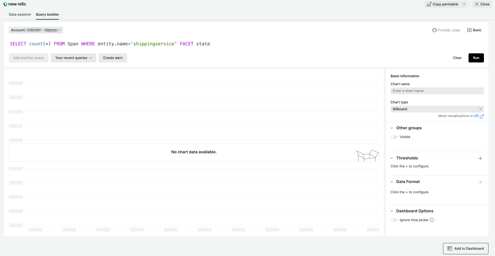
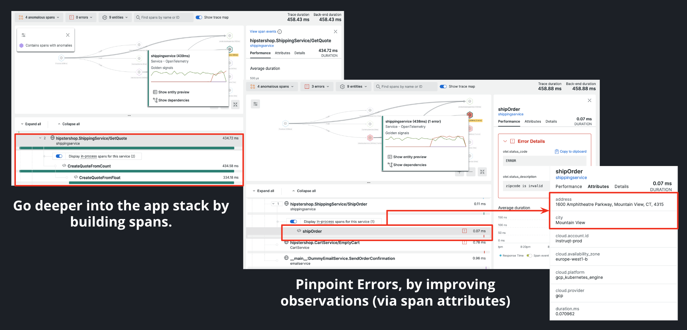

# Lab 4: Adding span attributes

In this lab you are going to add the ability to identify where Hipster Shop customers are located to increase revenue. You will do this by adding custom instrumentation to capture specific user attributes.

## A request from marketing
The marketing team and social media PR team are working together on the launch of a new Stetson hat collection for Hipster Shop. They have tapped your team to best identify where ad dollars should be spent across the Unites States. The teams would like to know where orders are being shipped to so they can begin targeting specific states with social media ads. 

## Your plan of action
In an moment of hopeful optimism, you query the data coming into Hipster Shop using the query below, but get nothing. Argh!   

*Confirm your environment is functioning the same way as the screenshot below by running the same query. Run a similar query for grouping data by city*

Next, you look up and down at the many functions in the request you looked at earlier in the lab. You are not able to see an attribute for State, City, or anything simlar to help find the location of shipping orders. What do you do? Order another $7 cappuccino? No! You decide roll up your gingham sleeves a little more to try and figure this out.   

*Confirm your application is functioning the same way as the lab intends by reviewing a distributed trace and looking at the attributes.*

## Fixing this issue
Realizing that you can't locate or query by the attribute "state" or "city", you know that your next step is to input some custom instrumentation code into the `shippingservice/main.go` file or you risk the chance of hipster's heads across the country not being accompanied by a Stetson hat :scream: 

At this point, your instrumentation provider (OpenTelemetry) is lacking the attribute(s) needed to collect the data you want. You will need to discover a way to import and add those attribute(s) to a span. You find this reference to [manual instrumentation](https://opentelemetry.io/docs/instrumentation/go/manual/) in the OpenTelemetry docs and begin your attempts to solve the issue here. 

> If you have pushed your technical skills to the limit, are running short on time in this lab, or would like to confirm your code for accuracy then refer to this [solution file](/reference/shippingservice-AFTER.go) for the answer to this problem in addition to a code snippet that will produce an error when a user doesn't provide a 5-digit zipcode

## Moving forward in the workshop
Once you have confirmed your ability to track city on shipped orders be sure to document your process. You are ready to move on in this workshop.  
* If you have completed each of the 4 labs with time still remaining in the workshop, please take a look at the [Additional Challenges](Additional-Challenges.md) available.  
* If you have completed each of the 4 labs on pace with expectatations, please move onto [Lab 5: Passing the torch](lab_5-passing-the-torch.md)