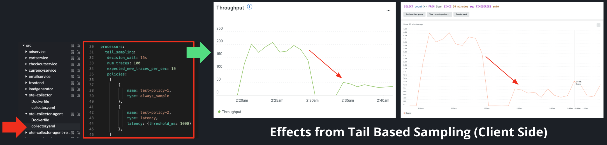

##OTel Collector Challenge
This portion of the workshop is intended for someone who has completed labs 1-4 with time to spare before moving onto the final portion of this workshop, lab 5, which is a group activity that will be completed in small groups.

It assumes you already have a build of the Hipster Shop app running locally.

## Step 1 - Receivers

Until now, you have not been collecting infrastructure-level data about your hosts (if hosted locally, then this is referring to your device). To bring this data into your observability pipeline, you will need to configure a receiver in your collector that can generate these metrics.

locate your collector agent file, `/src/otel-collector-agent/collector.yaml`. Replace what is currently listed under `receivers` with the code below:

```YAML
receivers:
  # FOK Workshop - Receivers - hostmetrics <- HERE
  hostmetrics:
    collection_interval: 20s
    scrapers:
      cpu:
        metrics:
          system.cpu.utilization:
            enabled: true
      load:
      memory:
        metrics:
          system.memory.utilization:
            enabled: true
      disk:
      filesystem:
        metrics:
          system.filesystem.utilization:
            enabled: true
      network:
      paging:
        metrics:
          system.paging.utilization:
            enabled: true
      processes:
  otlp:
    protocols:
      grpc:
```

Here, we've configured the `hostmetrics` receiver, which generates metrics about the host system by scraping from various sources. It collects the following metrics: CPU utilization, disk I/O, CPU load, file system utilization, memory utilization, network and TCP connection, and process count.

To utilize this receiver, you're going to add it to your `metrics` pipeline as shown below (any components you configure in your collector yaml file will only be used if they are added to at least one of the service pipelines):

```
service:
  pipelines:
    metrics:
      # FOK Workshop - Receivers - hostmetrics <- HERE
      receivers: [ otlp , hostmetrics ]
      processors: [ resourcedetection, k8sattributes, resource, cumulativetodelta, batch ]
      exporters: [ otlp ]
    traces:
    ...
```
***

## Step 2 - Processors

The collector is essentially a highly configurable system for processing telemetry data -- it offers a wide range of capabilities, including collecting host metrics (which we did above) and transforming attributes. In this section, we are going to implement the `tail_sampling` processor.

In tail-based sampling, the sampling decision is made only after all spans in a request have completed. This enables us to sample based on specific span attributes, meaning we are able to make more intelligent decisions on which traces are kept. For example, we can use it to sample only traces with latency or errors to help us quickly see issues in our system. Tail-based sampling is commonly used for latency analysis, since end-to-end latency can’t be computed until the end of a request.

To implement the `tail_sampling` processor, paste the following configuration under `processors`:

```
  # FOK Workshop - Processors - tail based sampling <- HERE
  tail_sampling:
   decision_wait: 15s
   num_traces: 100
   expected_new_traces_per_sec: 10
   policies:
    [
        {
            name: policy-1,
            type: always_sample
        },
        {
            name: policy-2,
            type: latency,
            latency: {threshold_ms: 1000}
        },
    ]
  batch:
  ...
```

Remember to add the tail sampling processor to your `traces` pipeline to utilize it:

```
service:
  pipelines:
  ...
    traces:
      # FOK Workshop - Processors - tail based sampling <- HERE
      receivers: [ otlp ]
      processors: [ resourcedetection, k8sattributes, resource, batch, tail_sampling ]
      exporters: [ otlp ]
  ...
```

**Tip**: It's best to compare trends using a simple NRQL query such as ``SELECT count(*) FROM Span SINCE 30 minutes ago TIMESERIES auto``.

***

## Part 3 - Exporters

For this part, you don't have to do any work! Please just draw your attention `exporters`. to We are using the OTLP exporter to send your observability data from the collector to New Relic!

```
exporters:
  otlp:
    endpoint: $OTEL_EXPORTER_OTLP_ENDPOINT
    headers:
      api-key: $NEW_RELIC_API_KEY
  logging:
    logLevel: DEBUG
```

***

## Last Step - See tail based sampling in action

Compare trends before these changes were made to the collector using a simple NRQL query such as ``SELECT count(*) FROM Span SINCE 30 minutes ago TIMESERIES auto``.

If you are not seeing these changes to take effect, exit ``skaffold dev`` (Press Control-C for Mac or Windows) to stop running the environment. Then run ``skaffold dev``. Wait 5-10 minutes and run the query again to see the changes in data ingest.  
